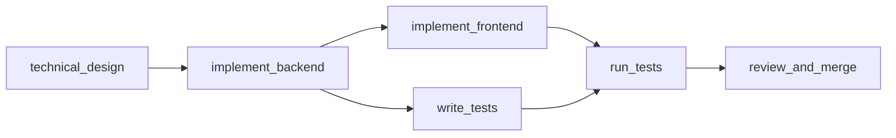
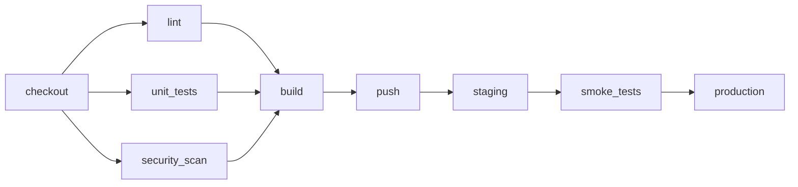
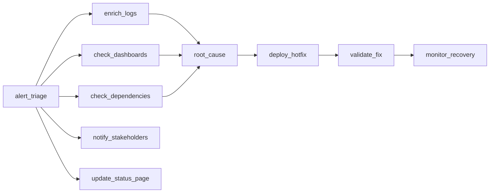
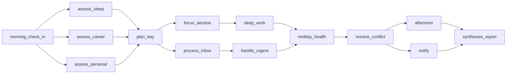

# Workflow Orchestrator

An OpenEnv environment that tests whether an LLM can manage DAG-based workflows. The agent assigns subtasks to simulated workers, runs tasks in parallel when possible, handles failures, stays within capacity limits, and combines results under time and cost budgets.

Four tasks, easy to hard: feature development, CI/CD deployment, production incident response, and daily planning across health, career, and personal goals.

## Quickstart

```bash
# Local
cd workflow_orchestrator && uv sync
uv run server
# Server starts at http://localhost:8000

# Docker
docker build -t workflow-orchestrator .
docker run -p 8000:8000 workflow-orchestrator

# Try it
curl -X POST http://localhost:8000/reset -H "Content-Type: application/json" -d '{"task_id": "easy"}'
curl -X POST http://localhost:8000/step -H "Content-Type: application/json" \
  -d '{"action_type": "delegate", "subtask_id": "technical_design", "agent_name": "tech_lead"}'
```

```bash
# Run inference (needs an LLM API)
export HF_TOKEN=<your-token>
export API_BASE_URL=https://router.huggingface.co/v1
export MODEL_NAME=Qwen/Qwen3-32B
python inference.py
```

## Example: Hard Task Walkthrough

A step-by-step trace of the agent working through the Production Incident Response. A greedy policy scores 0.07 on this task.

```
Step  1: delegate(alert_triage, triage_analyst)       → Triage done, 3 investigation tracks open
Step  2: delegate(enrich_logs, investigator_alpha)     → FAILS. Permanent failure, alpha can't do log analysis.
Step  3: delegate(check_dashboards, monitor)           → 2 tasks running at once (+0.10)
Step  4: retry(enrich_logs, investigator_beta)         → Switched to a different agent
Step  5: delegate(check_dependencies, investigator_alpha)  → Alpha can still do other work
Step  6: delegate(notify_stakeholders, communicator)   → Side task, doesn't block the main path
Step  7: delegate(root_cause_analysis, senior_engineer)
         → enrich_logs (beta) and check_dashboards (monitor) were done by
           different agents, so the conflict resolution check passes
Step  8: delegate(deploy_hotfix, deployer)             → Must happen before deployer goes offline at step 12
Step  9: delegate(update_status_page, communicator)
Step 10: delegate(validate_fix, senior_engineer)
Step 11: delegate(monitor_recovery, monitor)
Step 12: wait                                          → Monitoring wait (1 of 2)
Step 13: wait                                          → Monitoring wait (2 of 2)
Step 14: synthesize                                    → All 10 subtasks done

Score: 0.78 | 10/10 subtasks, 1/2 recoveries, 2/2 deadlines met
```

What makes this hard: the agent must (1) notice a permanent failure and pick a different agent, (2) use different agents for the two investigation tracks so the grader gives credit for conflict resolution, (3) deploy the hotfix before the deployer goes offline at step 12, (4) wait 2 steps for monitoring instead of finishing right away.

## Tasks

### Easy: Feature Development Sprint

6 subtasks, 4 agents (all reliable, same cost). Follow the DAG, with a chance to run `implement_frontend` and `write_tests` at the same time.



Time: 15 steps. Capacity: 4. No cost budget.

### Medium: Microservice Deployment Pipeline

9 subtasks, 5 agents with different speeds (1-2) and costs (1.0-3.0). The security scanner always fails on its first try (reliability override `[0.0, 1.0]`). After checkout, three tasks branch out (lint, unit tests, security scan) and can run in parallel.



Time: 16 steps. Capacity: 3. Cost budget: 35.

### Hard: Production Incident Response

10 subtasks, 7 agents with shared skills and costs from 1.0 to 5.0. Two built-in failure traps: `investigator_alpha` can never do `enrich_logs`, and `deployer` goes offline at step 12. Deadlines: root cause by step 10, hotfix by step 16. Two investigation tracks give different results, and the grader checks that different agents ran each one.



Time: 22 steps. Capacity: 3. Cost budget: 40.

### Expert: Life OS Daily Orchestration

14 subtasks across health, career, and personal goals. 8 agents, 2 of which have permanent failure traps. Career agent slows down at step 7, personal agent goes offline at step 10. The agent has to balance all three areas; ignoring health to push career work is penalized. Two points in the DAG require handling conflicting information.



Time: 25 steps. Capacity: 3. Cost budget: 55.

## Actions

Five actions, sent as JSON:

```json
{"action_type": "delegate", "subtask_id": "enrich_logs", "agent_name": "investigator_beta"}
{"action_type": "retry", "subtask_id": "run_security_scan", "agent_name": "security_scanner"}
{"action_type": "wait"}
{"action_type": "synthesize"}
{"action_type": "abort", "subtask_id": "stuck_task"}
```

Invalid actions are accepted but penalized. The step gets used up, a penalty applies, and the state doesn't change. This is on purpose: agents learn more from a penalty than from being silently ignored.

## Scoring

Each task has a grader that looks at the full event log, not just the final state. Scores go from 0.0 to 1.0 with a breakdown showing what the agent did well and where it lost points. The breakdown also includes counts like subtasks completed, recoveries achieved, and deadlines met.

Graders use **activity gates**: scoring dimensions that reward "doing no harm" (like error classification or staying within capacity) only count if the agent actually completed enough subtasks. An agent that does nothing scores 0.01, not free points.

**Rewards** come every step, not just at the end. Positive: correct delegation (+0.05), subtask done (+0.08), parallel tasks (+0.10), failure recovered (+0.10), useful wait (+0.03). Negative: dependency violation (-0.10), capacity violation (-0.15), wrong agent (-0.05), ignoring a failure for 2+ steps (-0.08). Step rewards guide learning; grader scores measure the final result. They are different on purpose.

## Benchmarks

Single run, Qwen3-32B through OpenRouter, temperature=0, max_tokens=4096:

| Policy | Easy | Medium | Hard | Expert |
|--------|------|--------|------|--------|
| Do-nothing | 0.01 | 0.01 | 0.01 | 0.01 |
| Greedy heuristic | 0.90 | 0.63 | 0.07 | 0.87 |
| **Qwen3-32B** | **0.90** | **0.63** | **0.73** | **0.74** |
| Best known (hand-written) | 0.90 | 0.63 | 0.78 | 0.95 |

The hard task is where scores vary most. The greedy heuristic scores 0.07 because it keeps retrying the permanently failing agent. The expert task has the biggest gap to the best known score (0.21) because balancing multiple goals is hard for current LLMs. The greedy heuristic scores higher than the LLM on expert (0.87 vs 0.74) because it delegates quickly and racks up completion points, but it scores 0.0 on conflict resolution and pillar balancing, which is where the best known policy (0.95) pulls ahead.

## API

| Endpoint | Method | Description |
|----------|--------|-------------|
| `/reset` | POST | Start a new episode (pass `{"task_id": "hard"}` to pick a task) |
| `/step` | POST | Run an action |
| `/state` | GET | Current state |
| `/tasks` | GET | List available tasks |
| `/grader` | POST | Score the last episode |
| `/baseline` | POST | Pre-computed baseline scores |
| `/health` | GET | Health check |
| `/web` | GET | Interactive dashboard |

## Project Structure

```
workflow_orchestrator/
├── inference.py              # Baseline inference script
├── baseline_scores.json
├── models.py                 # Pydantic Action/Observation/State
├── client.py                 # EnvClient subclass
├── openenv.yaml
├── Dockerfile
├── server/
│   ├── app.py               # FastAPI app + custom endpoints
│   ├── environment.py        # Core environment (reset/step/state)
│   ├── dag_executor.py       # DAG tracking + topological sort
│   ├── agent_pool.py         # Simulated agents with seeded failures
│   ├── reward_calculator.py  # Per-step reward logic
│   ├── graders.py            # Episode grading
│   ├── task_registry.py      # Task configs
│   └── gradio_ui.py          # Dashboard
└── tests/                    # 161 tests
```

## Known Limitations

- The baseline sometimes retries permanently failing agents 2-3 times before switching. Error classification is what LLMs struggle with most here.
- Cost optimization is weak. Neither the LLM nor the heuristic reliably picks cheaper agents when alternatives exist.
- Medium parallelism has a practical max of about 0.80 because agent speed differences prevent all three tasks from truly overlapping.

## Design Background

The tasks are shaped by work on multi-agent failure modes ([arxiv 2503.13657](https://arxiv.org/abs/2503.13657)), error spread in agent networks ([arxiv 2603.04474](https://arxiv.org/abs/2603.04474)), the finding that 3-agent teams hit a good balance between coordination cost and output ([ACL 2025](https://aclanthology.org/2025.acl-long.421/)), and difficulty-aware task routing ([arxiv 2509.11079](https://arxiv.org/html/2509.11079v1)). The per-step reward design comes from work showing that targeted RL feedback improves error recovery by up to 26% ([arxiv 2509.25370](https://arxiv.org/abs/2509.25370)).
