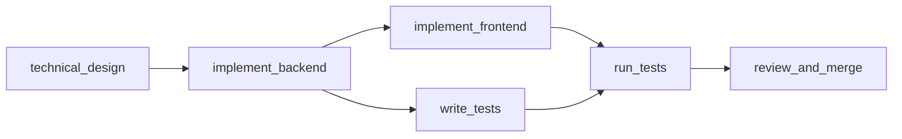
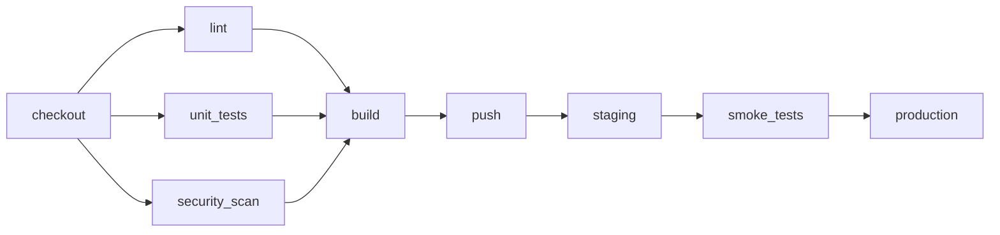
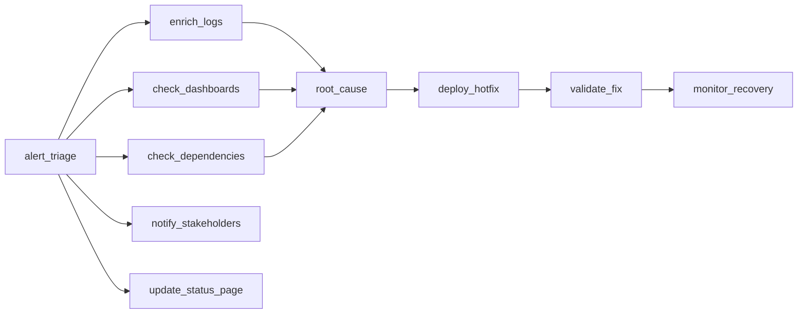
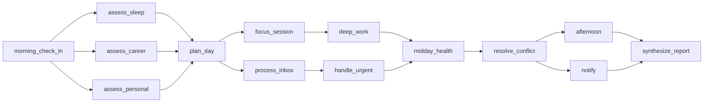

# Workflow Orchestrator Environment

An OpenEnv environment where an LLM agent acts as a **project coordinator**, managing DAG-based workflows of subtasks across simulated specialist agents with varying capabilities, failure rates, and cost profiles. Tests coordination, delegation, parallelism, failure recovery, and cost management.

## Motivation

Agent orchestration is the #1 enterprise AI trend — yet LLMs are terrible at it. Research documents 14+ failure modes in multi-agent systems (MAST taxonomy), up to 17x error amplification in unstructured networks (Spark to Fire), and only 25% baseline correctness with GPT-4o (ChatDev). This environment provides a controlled, deterministic testbed for training and evaluating LLM orchestration capabilities across four real-world scenarios forming a narrative arc: **build** a feature (Easy), **ship** it (Medium), **fix** the outage (Hard), and **orchestrate** your day (Expert).

**Novel domain:** Zero orchestration environments exist in OpenEnv today. This fills the biggest gap in the ecosystem — coordination, delegation, parallelism, failure recovery, and cost management are untested by any existing environment.

## Research Foundation

This environment is grounded in 5 recent research papers:

| Paper | Key Finding | How It Shaped Our Design |
|-------|-------------|--------------------------|
| **MAST Taxonomy** ([arxiv 2503.13657](https://arxiv.org/abs/2503.13657)) | 14 failure modes across 150+ multi-agent traces; GPT-4o achieves only 25% on ChatDev | Our tasks test 8 of 14 MAST failure modes (spec violation, role violation, step repetition, info withholding, premature termination, incomplete verification) |
| **Spark to Fire** ([arxiv 2603.04474](https://arxiv.org/abs/2603.04474)) | 17.2x error amplification in unstructured agent networks; hub injection → 100% infection | Hard task DAG topology creates realistic cascade potential; failure recovery rewards incentivize early intervention |
| **AgentErrorBench** ([arxiv 2509.25370](https://arxiv.org/abs/2509.25370)) | Targeted RL feedback improves error recovery by up to 26% across 5 failure categories | Dense per-step rewards target each error category; permanent vs. transient failure classification forces root-cause reasoning |
| **MARBLE / MultiAgentBench** ([ACL 2025](https://aclanthology.org/2025.acl-long.421/)) | 3-agent teams optimize coordination-performance balance; excessive iterations degrade coordination | Capacity limit of 3 concurrent tasks; milestone-based grading; DAG-based task structure |
| **DAAO** ([arxiv 2509.11079](https://arxiv.org/html/2509.11079v1)) | Task difficulty should dynamically determine orchestration strategy; 11% accuracy improvement | Our 4 tasks require fundamentally different strategies, not just more nodes |

## Capabilities Tested (22 Total)

Each difficulty level introduces **qualitatively different reasoning**, not just more nodes:

| # | Capability | Easy | Med | Hard | Expert | What It Tests |
|---|---|:---:|:---:|:---:|:---:|---|
| 1 | Dependency comprehension | ✓ | ✓ | ✓ | ✓ | Read DAG, understand what blocks what |
| 2 | Correct delegation | ✓ | ✓ | ✓ | ✓ | Match subtask type → agent capability |
| 3 | Sequential ordering | ✓ | ✓ | ✓ | ✓ | Don't delegate before prerequisites complete |
| 4 | Wait discipline | ✓ | ✓ | ✓ | ✓ | Wait when nothing is delegatable |
| 5 | Output synthesis | ✓ | ✓ | ✓ | ✓ | Combine outputs into final deliverable |
| 6 | Parallelism detection | | ✓ | ✓ | ✓ | Run independent subtasks concurrently |
| 7 | Failure recovery | | ✓ | ✓ | ✓ | Retry after agent failure |
| 8 | Capacity management | | ✓ | ✓ | ✓ | Stay within max concurrent task limit |
| 9 | Time pressure planning | | ✓ | ✓ | ✓ | Must parallelize to meet deadline |
| 10 | Cost awareness | | ✓ | ✓ | ✓ | Don't blindly retry expensive agents |
| 11 | Agent selection under overlap | | | ✓ | ✓ | Multiple agents for same task — pick best |
| 12 | Adaptation to agent dropout | | | ✓ | ✓ | Re-plan when agent goes offline |
| 13 | Conflicting info aggregation | | | ✓ | ✓ | Two tracks produce different findings |
| 14 | SLA milestone awareness | | | ✓ | ✓ | Hit deadlines or face escalating penalties |
| 15 | Patience under pressure | | | ✓ | | Wait for monitoring — resist premature synthesis |
| 16 | Priority reasoning | | | ✓ | ✓ | Side-channel tasks mustn't block critical path |
| 17 | Error classification | | | ✓ | ✓ | Distinguish permanent vs. transient failure |
| 18 | Multi-objective optimization | | | | ✓ | Balance competing pillar scores |
| 19 | Cross-domain conflict resolution | | | | ✓ | Reconcile health vs career vs personal |
| 20 | Agent cost-benefit analysis | | | ✓ | ✓ | When is the cheap agent actually more expensive? |
| 21 | Cascading delay awareness | | | | ✓ | Speed degradation means earlier delegation = critical |
| 22 | Multi-conflict episodes | | | | ✓ | Two distinct conflict resolution points |

**Difficulty progression:** Easy = DAG comprehension (1-5). Medium = parallelism + recovery + budgets (6-10). Hard = chaos adaptation + error classification (11-17). Expert = multi-objective optimization across life domains (18-22).

## Grader Design

Each task has a multi-dimensional grader returning a score in [0.0, 1.0] with a detailed breakdown. Graders analyze the **episode event log** (process matters, not just outcome) and are fully **deterministic** — same actions = same score.

| Task | Dimensions | Key Metrics |
|------|-----------|-------------|
| Easy | 7 | completion (85%), parallelism bonus (10%), episode complete (5%), invalid penalty, steps_used, theoretical_min, efficiency_ratio |
| Medium | 6 | completion (40%), parallelism (20%), failure recovery (20%), time efficiency (10%), cost efficiency (10%) |
| Hard | 10 | completion (20%), recovery (15%), error classification (10%), capacity (10%), parallelism (10%), cost (10%), conflict resolution (10%), SLA compliance (10%), monitoring patience (5%) |
| Expert | 10 | completion (15%), health pillar (12%), career pillar (10%), conflict resolution (20%), cost (8%), parallelism (10%), time (5%), error classification (8%), SLA (8%), communication (4%) |

**Activity-gated scoring:** Dimensions that reward "no harm" (error classification, capacity discipline, cost efficiency) scale with actual activity via `min(1.0, completed / threshold)`. A do-nothing policy scores 0.0, not free points.

## Action Space

| Field | Type | Description |
|-------|------|-------------|
| `action_type` | `"delegate"\|"retry"\|"wait"\|"synthesize"\|"abort"` | Which action to take |
| `subtask_id` | `Optional[str]` | Target subtask (required for delegate/retry/abort) |
| `agent_name` | `Optional[str]` | Agent to assign (required for delegate/retry) |

**Actions:**
- **delegate**: Assign a ready subtask to an idle, capable agent
- **retry**: Re-assign a failed subtask (same or different agent)
- **wait**: Advance time by 1 step; working agents tick
- **synthesize**: Combine all completed outputs (only valid when all subtasks done)
- **abort**: Permanently fail a non-completed subtask

Invalid actions are accepted but penalized — the step is consumed, a penalty is applied, and state remains unchanged.

## Observation Space

| Field | Type | Description |
|-------|------|-------------|
| `task_description` | `str` | Natural-language task objective |
| `subtasks` | `list[SubtaskInfo]` | Status of each subtask in the DAG |
| `agents` | `list[AgentInfo]` | Status of each simulated agent |
| `completed_outputs` | `dict[str, str]` | Outputs from finished subtasks |
| `errors` | `list[str]` | Errors from the current step |
| `time_remaining` | `int` | Steps left before timeout |
| `time_elapsed` | `int` | Steps taken so far |
| `capacity_limit` | `int` | Max concurrent in-progress tasks |
| `active_task_count` | `int` | Currently in-progress task count |
| `budget_remaining` | `Optional[float]` | Cost budget left (None if unlimited) |
| `budget_used` | `float` | Cost spent so far |
| `available_actions` | `list[str]` | Which action types are currently valid |
| `hint` | `Optional[str]` | One-line suggestion for the agent |
| `sla_milestones` | `Optional[dict[str, int]]` | SLA deadlines: subtask_id → deadline step |
| `failures_occurred` | `int` | Total failures so far |
| `failures_recovered` | `int` | Failures successfully retried |
| `done` | `bool` | Whether the episode has ended |
| `reward` | `float\|None` | Step reward |

## Tasks

### Easy: Feature Development Sprint



- **6 subtasks**, **4 agents** (all reliable, speed=1, cost=1.0)
- **Constraints**: time=15, capacity=4, no cost budget
- **Challenge**: Basic delegation ordering + optional parallel fan-out

### Medium: Microservice Deployment Pipeline



- **9 subtasks**, **5 agents** (speed 1-2, cost 1.0-3.0)
- **Constraints**: time=16, capacity=3, cost_budget=35.0
- **Challenge**: 3-way fan-out, guaranteed security scan failure requiring retry, cost awareness
- **Trap**: `security_scanner` always fails first attempt (reliability override `[0.0, 1.0]`)

### Hard: Production Incident Response



- **10 subtasks**, **7 agents** (overlapping capabilities, costs 1.0-5.0)
- **Constraints**: time=22, capacity=3, cost_budget=40.0
- **SLA milestones**: root_cause by step 10, deploy_hotfix by step 16
- **Traps**: `investigator_alpha` permanently fails on `enrich_logs`; `deployer` goes offline at step 12
- **Challenge**: Conflicting findings (enrich_logs vs check_dashboards produce different data — agent must use *different agents* to properly aggregate), monitoring patience (2 consecutive waits after validate_fix)

### Expert (Bonus): Life OS Daily Orchestration



- **14 subtasks**, **8 agents** (including 2 permanent failure traps)
- **Constraints**: time=25, capacity=3, cost_budget=55.0
- **SLA milestones**: plan_day by step 8, resolve_conflict by step 16, synthesize by step 23
- **Traps**: `wellness_monitor` permanently fails on health tasks; `executive_assistant` permanently fails on planning
- **Events**: career_agent speed degrades at step 7; personal_agent drops out at step 10
- **Challenge**: Multi-objective optimization across health/career/personal pillars, 2 conflict resolution points

## Reward Design

Dense per-step rewards with 7 positive and 9 negative signals:

| Signal | Value | Trigger |
|--------|-------|---------|
| correct_delegation | +0.05 | Right agent for right subtask |
| subtask_completed | +0.08 | Agent finishes successfully |
| parallelism_exploited | +0.10 | 2+ tasks concurrent |
| failure_recovered | +0.10 | Retry succeeds after failure |
| efficient_wait | +0.03 | Wait when nothing delegatable |
| dependency_violation | -0.10 | Delegate blocked subtask |
| capacity_violation | -0.15 | Exceed concurrent limit |
| permanent_retry | -0.06 | Retry permanently failing agent |

End-of-episode: +0.20 (all complete + synthesized), +0.10 * time_efficiency, +0.05 * cost_efficiency, -0.10 (incomplete).

## Benchmark Results

### Multi-Policy Comparison

| Policy | Easy | Medium | Hard | Expert | Avg |
|---|---|---|---|---|---|
| Do-nothing (all waits) | 0.01 | 0.01 | 0.01 | 0.01 | 0.01 |
| Greedy heuristic | 0.90 | 0.63 | **0.07** | 0.87 | 0.62 |
| **Qwen3-32B (baseline)** | **0.90** | **0.63** | **0.72** | **0.75** | **0.75** |
| Hand-crafted oracle | 0.90 | 0.63 | 0.78 | 0.95 | 0.82 |

### Oracle-vs-Baseline Gap Analysis

```
Easy:   Oracle 0.90 → Baseline 0.90 (gap: 0.00) — Ceiling reached
Medium: Oracle 0.63 → Baseline 0.63 (gap: 0.00) — Near-ceiling
Hard:   Oracle 0.78 → Baseline 0.72 (gap: 0.06) — Chaos adaptation gap
Expert: Oracle 0.95 → Baseline 0.75 (gap: 0.20) — Multi-objective gap
```

### Key Insights

- **Hard task is the discriminator**: The greedy heuristic scores **0.07** (10.3x worse than LLM baseline). It gets trapped in the permanent failure loop — unable to classify the failure and switch agents. This proves the hard task requires genuine multi-step reasoning.
- **Expert task paradox**: The greedy heuristic (0.87) **outperforms** the LLM (0.75) because rapid delegation beats deliberation when subtasks are straightforward. The LLM overthinks cost tradeoffs. However, the oracle (0.95) shows significant room for improvement through better parallelism and SLA planning.
- **Medium ceiling**: The 3-way parallelism bonus (0.20) is structurally difficult to achieve because the linter agent completes in 1 tick while others take 2, making simultaneous 3-way overlap impossible. The effective ceiling is ~0.80.

## Real-World Connections

This environment models challenges from established project management and incident response theory:

| Theory | Connection | Where It Appears |
|---|---|---|
| **Critical Path Method (CPM)** | DAG dependencies define the longest path through the workflow; parallelism shortens it | All tasks — agent must identify which subtasks are on the critical path |
| **Brooks's Law** ("adding people late makes it later") | Capacity limits prevent throwing more agents at the problem | Medium/Hard — 3-agent concurrency limit forces prioritization |
| **Incident Command System (ICS)** | Structured incident response with defined roles, communication channels, and escalation | Hard task — triage → investigate → root cause → deploy → validate → monitor |
| **Monte Carlo scheduling** | Stochastic agent reliability creates probabilistic completion times | All tasks — agent success is seeded but probabilistic; permanent failures require adaptation |
| **Theory of Constraints** | The bottleneck agent (slowest, most expensive, or most error-prone) determines throughput | Expert task — career_agent speed degradation at step 7 creates a shifting bottleneck |

## Example Episode: Hard Task Walkthrough

An annotated trace showing the agent navigating the Production Incident Response:

```
Step 1: delegate(alert_triage, triage_analyst)      → +0.05 correct delegation
Step 2: delegate(enrich_logs, investigator_alpha)    → FAILS (permanent failure trap!)
Step 3: delegate(check_dashboards, monitor)          → +0.10 parallelism (2 concurrent)
Step 4: retry(enrich_logs, investigator_beta)        → +0.05 correct recovery (different agent)
Step 5: delegate(check_dependencies, investigator_alpha) → Agent can still do other tasks
Step 6: delegate(notify_stakeholders, communicator)  → Side-channel task (doesn't block critical path)
Step 7: delegate(root_cause_analysis, senior_engineer)
        → Conflict resolution: enrich_logs (investigator_beta) and
          check_dashboards (monitor) were completed by DIFFERENT agents ✓
Step 8: delegate(deploy_hotfix, deployer)            → Before deployer goes offline at step 12
Step 9: delegate(update_status_page, communicator)
Step 10: delegate(validate_fix, senior_engineer)
Step 11: delegate(monitor_recovery, monitor)
Step 12: wait                                        → Monitoring patience (1/2 required waits)
Step 13: wait                                        → Monitoring patience (2/2) ✓
Step 14: synthesize                                  → All 10 subtasks complete → episode ends

Score: 0.78 | Breakdown: completion=0.20, recovery=0.075, error_class=0.10,
capacity=0.10, parallelism=0.03, cost=0.025, conflict=0.10, sla=0.10, patience=0.05
```

**What makes this hard**: The agent must (1) recognize investigator_alpha's permanent failure and switch to investigator_beta, (2) use *different* agents for the two investigation tracks to properly aggregate conflicting findings, (3) delegate the hotfix *before* the deployer goes offline at step 12, (4) resist the urge to synthesize immediately after validate_fix and wait 2 steps for monitoring.

## Setup

### Local Development

```bash
cd workflow_orchestrator
uv sync
uvicorn server.app:app --reload --host 0.0.0.0 --port 8000
```

### Docker

```bash
docker build -t workflow-orchestrator .
docker run -p 8000:8000 workflow-orchestrator
```

### Running Inference

```bash
export HF_TOKEN=<your-token>
export API_BASE_URL=https://router.huggingface.co/v1
export MODEL_NAME=Qwen/Qwen3-32B
python inference.py
```

## API Endpoints

| Endpoint | Method | Description |
|----------|--------|-------------|
| `/reset` | POST | Reset environment, returns observation |
| `/step` | POST | Execute action, returns observation |
| `/state` | GET | Current environment state |
| `/tasks` | GET | List all available tasks |
| `/grader` | POST | Grade most recent episode |
| `/baseline` | POST | Return pre-computed baseline scores |
| `/health` | GET | Container health check |
| `/web` | GET | Interactive web interface |
| `/ws` | WS | WebSocket for persistent sessions |

## Project Structure

```
workflow_orchestrator/
├── openenv.yaml             # OpenEnv manifest
├── pyproject.toml            # Dependencies and metadata
├── Dockerfile                # Multi-stage Docker build
├── README.md                 # This file
├── inference.py              # Baseline inference script
├── baseline_scores.json      # Pre-computed baseline scores
├── requirements.txt          # Pip-compatible dependencies
├── models.py                 # Pydantic Action/Observation/State models
├── client.py                 # OrchestratorClient (EnvClient subclass)
├── __init__.py               # Module exports
├── server/
│   ├── app.py               # FastAPI application + custom endpoints
│   ├── environment.py        # Core environment (reset/step/state)
│   ├── dag_executor.py       # DAG state tracking + dependency resolution
│   ├── agent_pool.py         # Simulated agent state machines
│   ├── reward_calculator.py  # Dense reward computation
│   ├── graders.py            # Per-task grading functions
│   ├── task_registry.py      # Easy/medium/hard/expert task configurations
│   └── observation_formatter.py  # Text rendering for LLM consumption
└── tests/                    # 160+ passing tests
```

## Limitations & Future Work

Transparent reporting of where the current design falls short:

- **LLM baseline retries permanently failing agents**: The Qwen3-32B baseline sometimes attempts 2-3 retries on `investigator_alpha` before switching agents, burning steps and accumulating penalties. Error classification remains the weakest LLM capability.
- **Cost optimization is weak**: Neither the LLM nor the greedy heuristic consistently picks cheaper agents when multiple capable agents are available. The cost efficiency dimension rarely exceeds 0.03 in practice.
- **Expert task sliding window**: The 6-turn history window in `inference.py` may not retain enough context for the 14-subtask expert task. Agents sometimes re-delegate already-completed subtasks late in the episode.
- **Medium parallelism ceiling**: Agent speed mismatches (linter=1 tick, others=2 ticks) make the 3-way parallelism bonus structurally unachievable with the current agent pool. The effective medium ceiling is ~0.80, not 1.0.
- **No RL training loop**: This environment is designed to be RL-trainable (dense rewards, deterministic seeding, concurrent sessions), but we have not yet trained PPO/DQN agents to validate learnability. Future work could prove the reward signal produces meaningful policy gradients.
