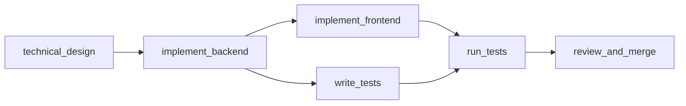
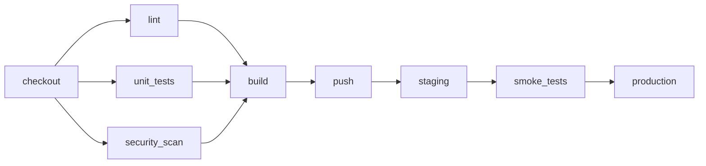
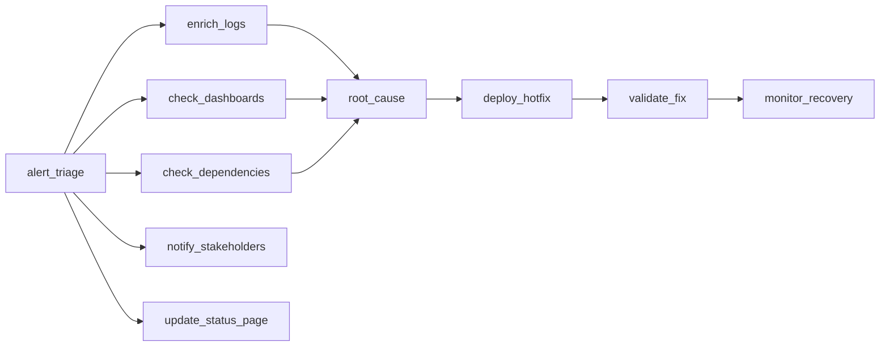
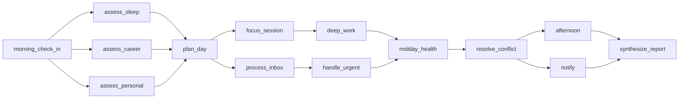

# Workflow Orchestrator

An OpenEnv environment for evaluating how well an LLM agent can coordinate DAG-based workflows. The agent assigns subtasks to simulated specialist agents, exploits parallelism, recovers from failures, manages limited capacity, and synthesizes outputs under time and cost constraints.

Four scenarios of increasing difficulty: feature development, CI/CD deployment, production incident response, and daily planning across competing priorities.

## Quickstart

```bash
# Local
cd workflow_orchestrator && uv sync
uv run server
# Server starts at http://localhost:8000

# Docker
docker build -t workflow-orchestrator .
docker run -p 8000:8000 workflow-orchestrator

# Try it
curl -X POST http://localhost:8000/reset -H "Content-Type: application/json" -d '{"task_id": "easy"}'
curl -X POST http://localhost:8000/step -H "Content-Type: application/json" \
  -d '{"action_type": "delegate", "subtask_id": "technical_design", "agent_name": "tech_lead"}'
```

```bash
# Run inference (needs an LLM API)
export HF_TOKEN=<your-token>
export API_BASE_URL=https://router.huggingface.co/v1
export MODEL_NAME=Qwen/Qwen3-32B
python inference.py
```

## Example: Hard Task Walkthrough

An annotated trace showing the agent navigating the Production Incident Response. This is the task that separates heuristics from reasoning. A greedy policy scores 0.07 here.

```
Step  1: delegate(alert_triage, triage_analyst)       → Triage confirmed, 3 investigation tracks unlocked
Step  2: delegate(enrich_logs, investigator_alpha)     → FAILS. Permanent failure, alpha lacks log tooling.
Step  3: delegate(check_dashboards, monitor)           → Parallelism: 2 tasks concurrent (+0.10)
Step  4: retry(enrich_logs, investigator_beta)         → Correct recovery: switched to a different agent
Step  5: delegate(check_dependencies, investigator_alpha)  → Alpha can still do other task types
Step  6: delegate(notify_stakeholders, communicator)   → Side channel, doesn't block critical path
Step  7: delegate(root_cause_analysis, senior_engineer)
         → enrich_logs (beta) and check_dashboards (monitor) completed by
           different agents, so conflict resolution criterion is met
Step  8: delegate(deploy_hotfix, deployer)             → Must happen before deployer goes offline at step 12
Step  9: delegate(update_status_page, communicator)
Step 10: delegate(validate_fix, senior_engineer)
Step 11: delegate(monitor_recovery, monitor)
Step 12: wait                                          → Monitoring patience (1 of 2 required waits)
Step 13: wait                                          → Monitoring patience (2 of 2)
Step 14: synthesize                                    → All 10 subtasks complete

Score: 0.78 | 10/10 subtasks, 1/2 recoveries, 2/2 SLA milestones met
```

What makes this hard: the agent must (1) recognize a permanent failure and switch agents, (2) use different agents for the two investigation tracks so the grader credits conflict resolution, (3) deploy the hotfix before the deployer drops out at step 12, (4) resist synthesizing immediately after validate_fix and wait 2 steps for monitoring.

## Tasks

### Easy: Feature Development Sprint

6 subtasks, 4 agents (all reliable, same cost). Basic DAG traversal with an optional parallelism opportunity where `implement_frontend` and `write_tests` can run concurrently.



Time: 15 steps. Capacity: 4. No cost budget.

### Medium: Microservice Deployment Pipeline

9 subtasks, 5 agents with varying speed (1-2) and cost (1.0-3.0). The security scanner always fails its first attempt (reliability override `[0.0, 1.0]`). Three-way fan-out after checkout means the agent should parallelize lint, unit tests, and security scan.



Time: 16 steps. Capacity: 3. Cost budget: 35.

### Hard: Production Incident Response

10 subtasks, 7 agents with overlapping capabilities and costs from 1.0 to 5.0. Two designed failure traps: `investigator_alpha` permanently cannot do `enrich_logs`, and `deployer` drops offline at step 12. SLA milestones require root cause by step 10 and hotfix by step 16. Two investigation tracks produce conflicting findings, and the grader checks that different agents ran each track.



Time: 22 steps. Capacity: 3. Cost budget: 40.

### Expert: Life OS Daily Orchestration

14 subtasks across health, career, and personal pillars. 8 agents including 2 permanent failure traps. Career agent slows down at step 7, personal agent drops out at step 10. The agent must balance competing objectives; sacrificing health entirely for career throughput is penalized. Two conflict resolution points require reconciling contradictory inputs.



Time: 25 steps. Capacity: 3. Cost budget: 55.

## Actions

Five actions, sent as JSON:

```json
{"action_type": "delegate", "subtask_id": "enrich_logs", "agent_name": "investigator_beta"}
{"action_type": "retry", "subtask_id": "run_security_scan", "agent_name": "security_scanner"}
{"action_type": "wait"}
{"action_type": "synthesize"}
{"action_type": "abort", "subtask_id": "stuck_task"}
```

Invalid actions are accepted but penalized. The step is consumed, a penalty applies, and state doesn't change. RL agents learn from negative signals, so silent rejection would be worse.

## Scoring

Each task has a multi-dimensional grader that analyzes the episode event log. Scores are in [0.0, 1.0] with breakdowns including diagnostic metadata (subtask counts, recovery counts, SLA details).

Graders use **activity gates**: dimensions that reward "no harm" (error classification, capacity discipline, cost efficiency) scale with actual completion. A do-nothing policy earns 0.01.

**Reward signals** are dense and per-step, not binary end-of-episode. Positive: correct delegation (+0.05), subtask completed (+0.08), parallelism (+0.10), failure recovered (+0.10), efficient wait (+0.03). Negative: dependency violation (-0.10), capacity violation (-0.15), wrong agent (-0.05), unrecovered failure (-0.08 after 2+ steps). Per-step rewards are training signals; grader scores are episode-level evaluation metrics. These intentionally diverge.

## Benchmarks

Single-run scores, Qwen3-32B via OpenRouter, temperature=0, max_tokens=4096:

| Policy | Easy | Medium | Hard | Expert |
|--------|------|--------|------|--------|
| Do-nothing | 0.01 | 0.01 | 0.01 | 0.01 |
| Greedy heuristic | 0.90 | 0.63 | 0.07 | 0.87 |
| **Qwen3-32B** | **0.90** | **0.63** | **0.73** | **0.74** |
| Oracle | 0.90 | 0.63 | 0.78 | 0.95 |

The hard task is the strongest discriminator. The greedy heuristic scores 0.07 because it gets stuck retrying the permanently failing agent. The expert task has the largest oracle gap (0.21) because multi-objective balancing is genuinely hard for current LLMs. The greedy heuristic actually outperforms the LLM on expert (0.87 vs 0.74) because rapid delegation beats deliberation when subtasks are straightforward, but it can't handle the conflict resolution points that the oracle nails.

## API

| Endpoint | Method | Description |
|----------|--------|-------------|
| `/reset` | POST | Start new episode (pass `{"task_id": "hard"}` to select task) |
| `/step` | POST | Execute an action |
| `/state` | GET | Current state snapshot |
| `/tasks` | GET | List available tasks |
| `/grader` | POST | Score the most recent episode |
| `/baseline` | POST | Pre-computed baseline scores |
| `/health` | GET | Health check |
| `/web` | GET | Interactive dashboard |

## Project Structure

```
workflow_orchestrator/
├── inference.py              # Baseline inference script
├── baseline_scores.json
├── models.py                 # Pydantic Action/Observation/State
├── client.py                 # EnvClient subclass
├── openenv.yaml
├── Dockerfile
├── server/
│   ├── app.py               # FastAPI app + custom endpoints
│   ├── environment.py        # Core environment (reset/step/state)
│   ├── dag_executor.py       # DAG tracking + topological sort
│   ├── agent_pool.py         # Simulated agents with seeded failures
│   ├── reward_calculator.py  # Dense per-step rewards
│   ├── graders.py            # Multi-dimensional episode grading
│   ├── task_registry.py      # Task configs
│   └── gradio_ui.py          # Dashboard
└── tests/                    # 161 tests
```

## Known Limitations

- The baseline sometimes retries permanently failing agents 2-3 times before switching. Error classification remains the weakest LLM capability here.
- Cost optimization is underutilized. Neither the LLM nor heuristic consistently picks cheaper agents when alternatives exist.
- Medium parallelism has a structural ceiling (~0.80) because agent speed mismatches prevent true 3-way overlap.

## Design Background

The task designs draw on the MAST taxonomy of multi-agent failure modes ([arxiv 2503.13657](https://arxiv.org/abs/2503.13657)), error amplification in agent networks ([arxiv 2603.04474](https://arxiv.org/abs/2603.04474)), MARBLE's finding that 3-agent teams optimize coordination overhead ([ACL 2025](https://aclanthology.org/2025.acl-long.421/)), and difficulty-aware orchestration from DAAO ([arxiv 2509.11079](https://arxiv.org/html/2509.11079v1)). Dense reward shaping is informed by AgentErrorBench's result that targeted RL feedback improves recovery by up to 26% ([arxiv 2509.25370](https://arxiv.org/abs/2509.25370)).
