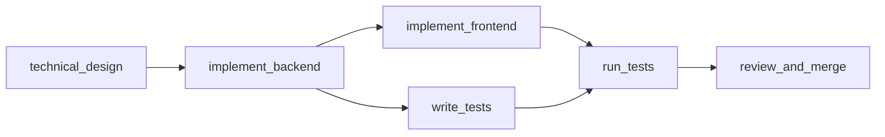
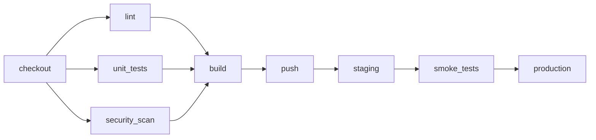
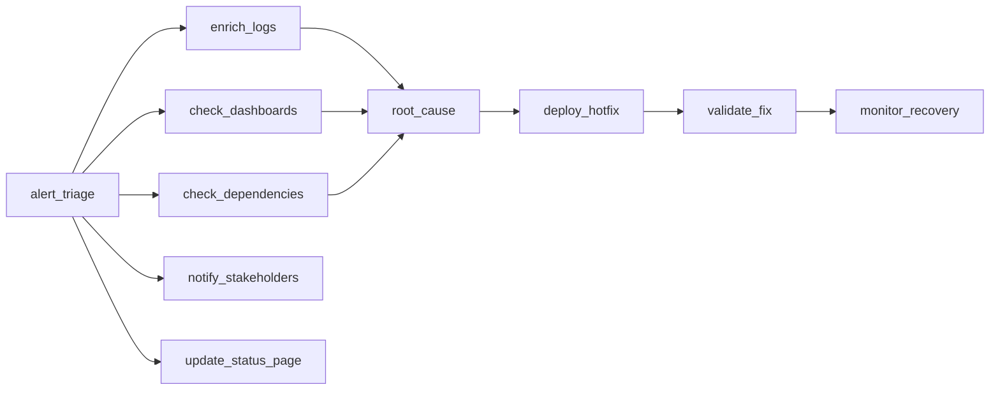
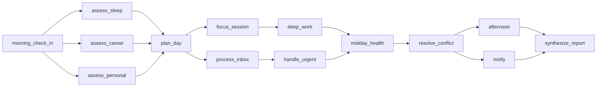

# Workflow Orchestrator

An OpenEnv environment for training LLM agents to coordinate DAG-based workflows. The agent acts as a project coordinator — delegating subtasks to simulated specialist agents, managing dependencies, recovering from failures, and staying within time and cost budgets.

The four tasks form a narrative arc: **build** a feature, **ship** it through CI/CD, **fix** the production outage it causes, and **orchestrate** a full day across competing priorities. Each level introduces qualitatively different reasoning, not just more nodes.

Nothing like this exists in OpenEnv today. Existing environments test tool use (Calendar Gym), code execution (Coding Env), or web navigation (BrowserGym). None test coordination, delegation, parallelism, failure recovery, or cost management — the core challenges of agent orchestration, which is the #1 enterprise AI trend heading into 2027.

## Tasks

### Easy: Feature Development Sprint

6 subtasks, 4 agents (all reliable). Straightforward DAG traversal with an optional parallelism opportunity.



Time budget: 15 steps. Capacity: 4 concurrent. No cost budget.

### Medium: Microservice Deployment Pipeline

9 subtasks, 5 agents with varying speed and cost. The security scanner is guaranteed to fail on the first attempt (reliability override `[0.0, 1.0]`) — the agent must recognize the failure, retry, and still stay within the cost budget of 35.



Time budget: 16 steps. Capacity: 3 concurrent. Cost budget: 35.

### Hard: Production Incident Response

10 subtasks, 7 agents with overlapping capabilities and costs ranging from 1.0 to 5.0. Two designed failure traps: `investigator_alpha` permanently cannot do `enrich_logs` (it lacks the log tooling), and `deployer` drops offline at step 12. The agent must classify errors (permanent vs transient), reassign to different agents, and meet SLA milestones (root cause by step 10, hotfix deployed by step 16). Two investigation tracks produce conflicting findings — the grader checks that the agent used different agents for each to properly aggregate evidence.



Time budget: 22 steps. Capacity: 3 concurrent. Cost budget: 40. SLA milestones: root_cause by step 10, deploy_hotfix by step 16.

### Expert (Bonus): Life OS Daily Orchestration

14 subtasks across health, career, and personal pillars. 8 agents including 2 permanent failure traps. Career agent slows down at step 7, personal agent drops offline at step 10. The agent must balance competing objectives — sacrificing health entirely for career throughput is penalized. Two conflict resolution points require the agent to reconcile contradictory inputs.



Time budget: 25 steps. Capacity: 3 concurrent. Cost budget: 55. SLA milestones: plan by step 8, resolve conflict by step 16, synthesize by step 23.

## Action Space

Five actions, sent as JSON:

```json
{"action_type": "delegate", "subtask_id": "enrich_logs", "agent_name": "investigator_beta"}
{"action_type": "retry", "subtask_id": "run_security_scan", "agent_name": "security_scanner"}
{"action_type": "wait"}
{"action_type": "synthesize"}
{"action_type": "abort", "subtask_id": "stuck_task"}
```

Invalid actions are accepted but penalized — the step is consumed, the penalty is applied, and state doesn't change. This is deliberate: RL agents learn from negative signals, and silent rejection teaches nothing.

## Observation Space

Each step returns a full observation with: task description, subtask statuses (pending/ready/in_progress/completed/failed with dependencies, assignments, errors, attempt counts), agent statuses (idle/working/offline with capabilities, speed, cost, reliability), completed outputs, time remaining, capacity usage, budget tracking, available actions, SLA milestones, failure counts, and an optional hint.

## Reward Design

Dense per-step rewards — not just a binary score at the end.

Positive signals: correct delegation (+0.05), subtask completed (+0.08), parallelism exploited (+0.10), failure recovered (+0.10), efficient wait (+0.03), cost-efficient choice (+0.04), communication sent (+0.05).

Negative signals: dependency violation (-0.10), capacity violation (-0.15), wrong agent (-0.05), permanent retry (-0.06), unnecessary wait (-0.03), unrecovered failure (-0.08 after 2+ steps), SLA penalty (-0.05/step past deadline, capped).

End-of-episode: +0.20 for completing all subtasks and synthesizing, plus time and cost efficiency bonuses. -0.10 for incomplete episodes.

Per-step rewards are RL training signals. Grader scores are episode-level evaluation metrics. These intentionally diverge — rewards encourage action discovery, graders evaluate trajectory quality.

## Grading

Each task has a multi-dimensional grader that analyzes the episode event log (not just the final state). Scores are in [0.0, 1.0] with detailed breakdowns including diagnostic metadata (subtask counts, recovery counts, SLA milestone details).

Graders use **activity gates**: dimensions that reward "no harm" (error classification, capacity discipline, cost efficiency) scale with actual completion. A do-nothing policy earns 0.01, not free points.

| Task | Dimensions | Heaviest Weights |
|------|-----------|-----------------|
| Easy | 7 | completion (85%), parallelism bonus (10%) |
| Medium | 8 | completion (40%), parallelism (20%), failure recovery (20%) |
| Hard | 18 | completion (20%), recovery (15%), SLA (10%), conflict resolution (10%), + diagnostics |
| Expert | 15 | conflict resolution (20%), completion (15%), health pillar (12%), + diagnostics |

## Baseline Scores

Tested with Qwen3-32B via OpenRouter (temperature=0):

| Policy | Easy | Medium | Hard | Expert |
|--------|------|--------|------|--------|
| Do-nothing | 0.01 | 0.01 | 0.01 | 0.01 |
| Greedy heuristic | 0.90 | 0.63 | 0.07 | 0.87 |
| **Qwen3-32B** | **0.90** | **0.63** | **0.73** | **0.74** |
| Oracle | 0.90 | 0.63 | 0.78 | 0.95 |

The hard task is the strongest discriminator — the greedy heuristic scores 0.07 because it gets trapped retrying the permanently failing agent. The expert task has the largest oracle gap (0.21) because multi-objective balancing across pillars is genuinely hard for current LLMs.

## Setup

```bash
# Local
cd workflow_orchestrator && uv sync
uv run server

# Docker
docker build -t workflow-orchestrator .
docker run -p 8000:8000 workflow-orchestrator

# Inference
export HF_TOKEN=<your-token>
export API_BASE_URL=https://router.huggingface.co/v1
export MODEL_NAME=Qwen/Qwen3-32B
python inference.py
```

## API

| Endpoint | Method | Description |
|----------|--------|-------------|
| `/reset` | POST | Start new episode (pass `{"task_id": "hard"}` to select task) |
| `/step` | POST | Execute an action |
| `/state` | GET | Current state snapshot |
| `/tasks` | GET | List available tasks with metadata |
| `/grader` | POST | Score the most recent episode |
| `/baseline` | POST | Pre-computed baseline scores |
| `/health` | GET | Container health check |
| `/web` | GET | Interactive dashboard |
| `/ws` | WS | WebSocket for persistent sessions |

## Project Structure

```
workflow_orchestrator/
├── inference.py              # Baseline inference script (repo root)
├── baseline_scores.json      # Pre-computed scores
├── models.py                 # Pydantic Action/Observation/State models
├── client.py                 # OrchestratorClient (EnvClient subclass)
├── openenv.yaml              # OpenEnv manifest
├── Dockerfile                # Multi-stage build
├── server/
│   ├── app.py               # FastAPI app + custom endpoints
│   ├── environment.py        # Core environment (reset/step/state)
│   ├── dag_executor.py       # DAG state tracking + topological sort
│   ├── agent_pool.py         # Simulated agents with seeded failures
│   ├── reward_calculator.py  # Dense per-step reward computation
│   ├── graders.py            # Multi-dimensional episode grading
│   ├── task_registry.py      # Task configs (DAGs, agents, constraints)
│   └── gradio_ui.py          # Mission Control dashboard
└── tests/                    # 161 tests
```

## Known Limitations

- The Qwen3-32B baseline sometimes retries permanently failing agents 2-3 times before switching. Error classification is the weakest LLM capability tested.
- Cost optimization is underutilized — neither the LLM nor heuristic consistently picks cheaper agents when multiple capable agents exist.
- Medium task parallelism has a structural ceiling (~0.80) due to agent speed mismatches making true 3-way overlap impossible.

## Research Grounding

The task designs draw on the MAST taxonomy of multi-agent failure modes (14 modes across 150+ traces, [arxiv 2503.13657](https://arxiv.org/abs/2503.13657)), error amplification dynamics in agent networks ([arxiv 2603.04474](https://arxiv.org/abs/2603.04474)), the MARBLE finding that 3-agent teams optimize the coordination-performance tradeoff ([ACL 2025](https://aclanthology.org/2025.acl-long.421/)), and difficulty-aware orchestration strategies from DAAO ([arxiv 2509.11079](https://arxiv.org/html/2509.11079v1)). The dense reward design is informed by AgentErrorBench's finding that targeted RL feedback improves error recovery by up to 26% ([arxiv 2509.25370](https://arxiv.org/abs/2509.25370)).
